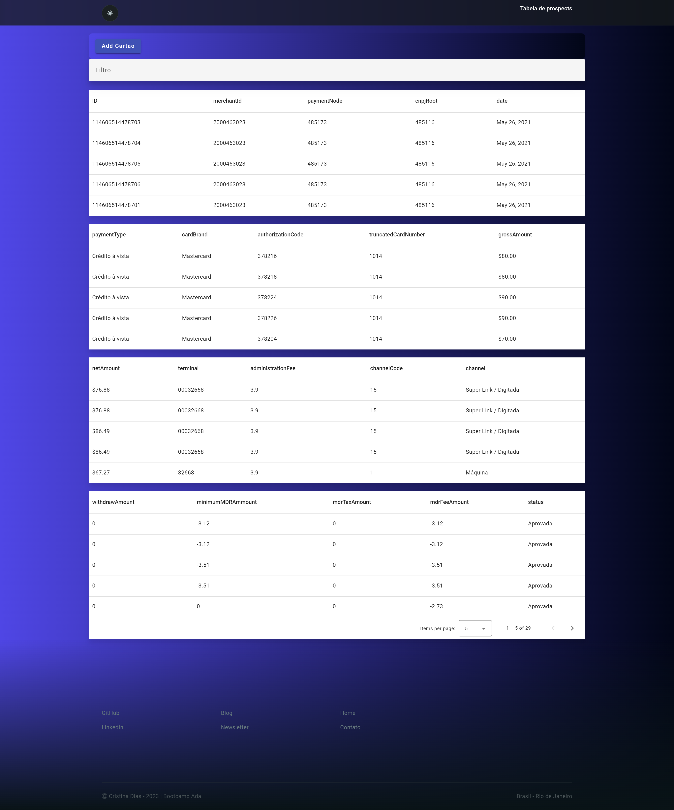
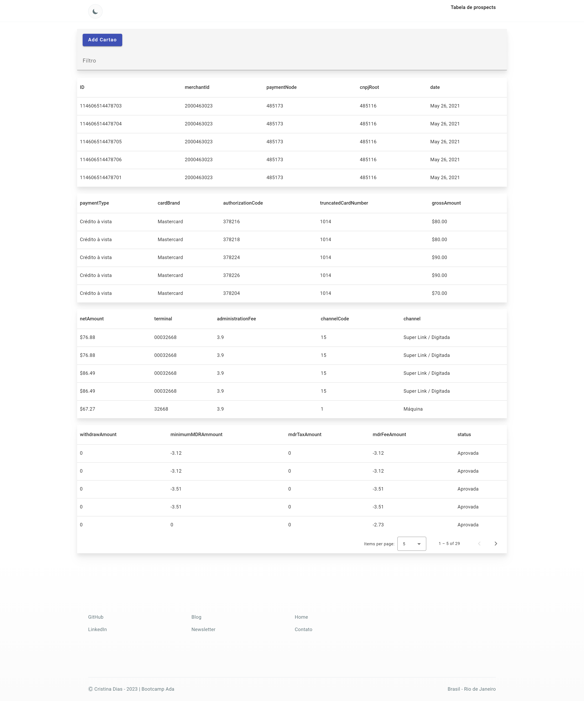

## Angular - Cielo

Aplicação de desenvolvimento web no framework Angular, de temas dark e light para o projeto final de dashboard com os dados fornecidos da api fake.

Desenvolvido como parte do bootcamp front-end oferecido pela Ada Tech em parceria com a Cielo, a aplicação retorna os dados de uma API e os exibe em uma lista.

O usuário pode clicar no botão adicionar, e aparece um pop-up (modal), onde poderá adicionar as informações para serem exibidas em tela. 

O usuário ainda pode buscar os dados pelo campo de filtro, e assim obter a lista de acordo com as informações que precisa.

## Instalação

Baixar esse repositório e rodar os seguintes comandos:

```bash
  npm install && ng serve
```


**Back-end:**
Certifique-se de estar rodando a [API](https://github.com/crisgit/mockjson) localmente.

Neste projeto também foi adicionado o arquivo db.json 

### Front-end


>Tela do front:
  
<p  align="center">

</p>

<p  align="center">

</p>


### Getting Started


## Rodar localmente

  
caso possua o gerenciador de versão do node `nvm` necessário Node => v18

  

```bash

nvm  use && npm  install && npm start

```

  

ou

  

```bash

npm  install && npm start

```

  

#### Versão do Angular: 16.1.0

  


